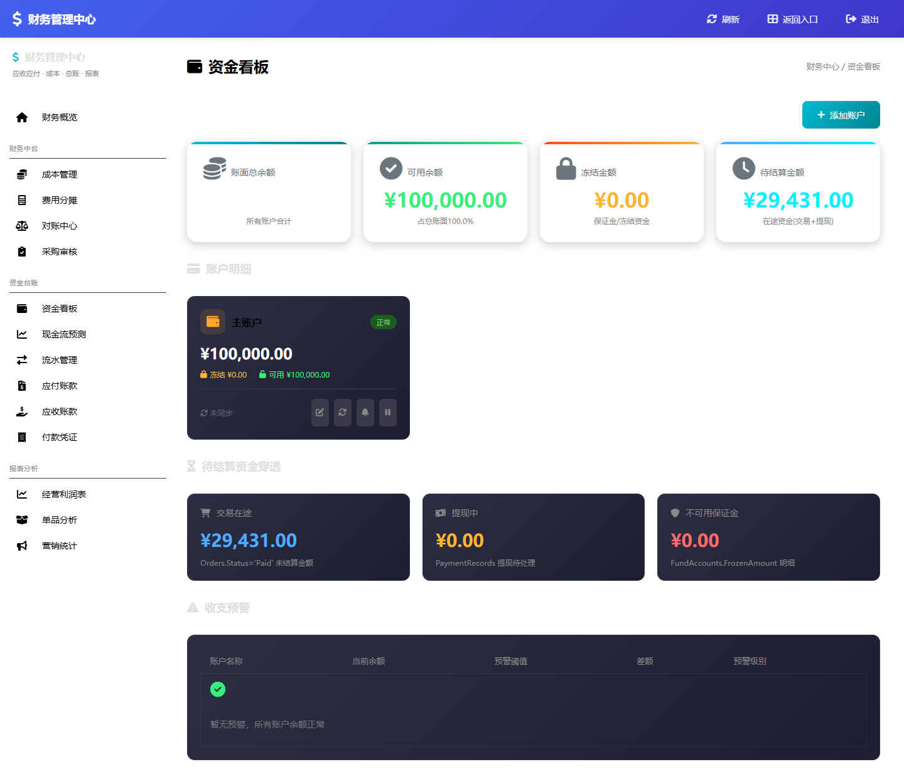
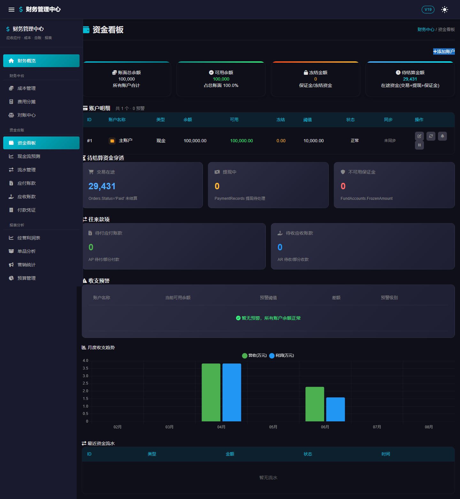
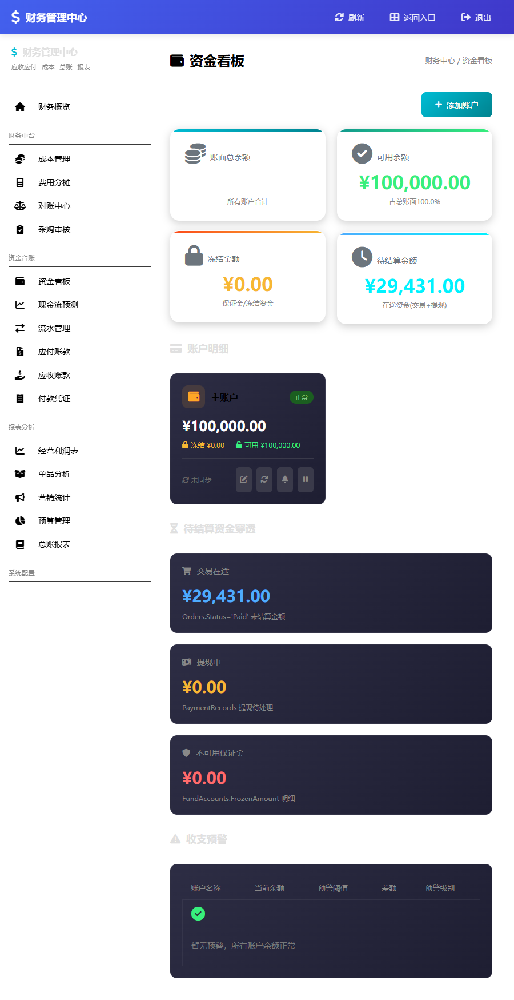
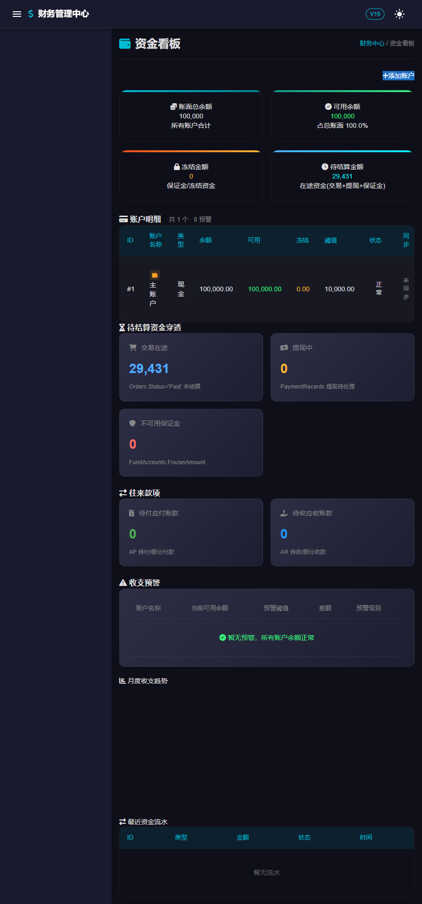
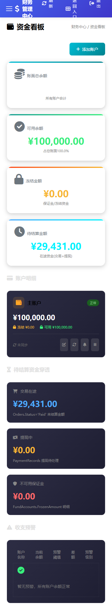
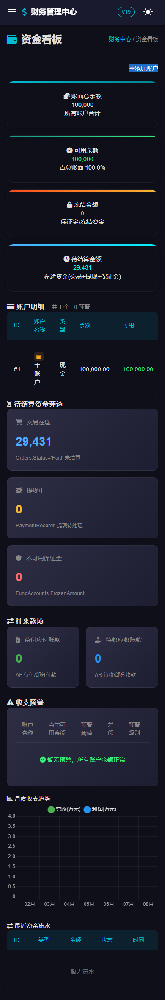
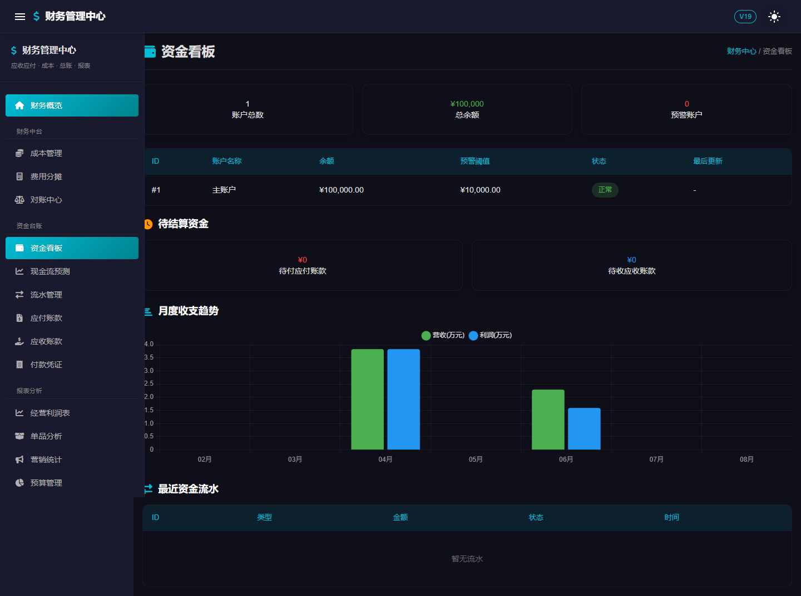

# 资金看板 V18 vs V19 视觉与功能对比报告

> V18.3 (Classic ASP / IIS) vs V19 (ASP.NET Core · Blazor Server) — 「资金看板」三断点视觉保真 + 功能覆盖对比
> 页面：V18 `/admin/finance/fund_dashboard.asp` ↔ V19 `/admin/finance/fund-dashboard`
> 采集日期：2026-07-20（初版） ｜ 迭代修复：2026-07-20（轨道 A~E 全部执行完成）
> 环境：本机 localhost（IIS:80 + PerfumeShop.Admin:5207 + SQL Server `localhost\YOURPERFUME`）

---

## 0. 结论摘要（TL;DR）- 迭代后更新

> **2026-07-20 迭代已完成。** 轨道 A（V18 热修）+ 轨道 B~E（V19 全面收敛）全部执行并通过截图验证。

- **V19 已完成功能收敛。** 现在 V19 资金看板包含 V18 全功能：4 卡统计（账面/可用/冻结/待结算）、账户 CRUD、待结算穿透 + 弹窗、预警分级表、异常监控横幅，同时保留 V19 原有的月度收支趋势图与最近资金流水表。布局统一为深色主题（复用 `finance-dark.css` + 自建样式）。
- **数据口径已统一。** 待结算金额两版均取「交易在途 + 提现中 + 保证金」口径（当前 = ¥29,431.00）。V18 `PendingSettlement` 字段冲突已修正。
- **主题切换确认。** V19 头部主题按钮对本页无效（页面硬编码深色），V18 无切换。两版资金看板均为深色单主题。
- **初版 3 个缺陷已全部修复（详见 §7 更新）。**

---

## 1. 环境与方法

| 项 | 说明 |
|---|---|
| V18 | Classic ASP，IIS 端口 80，登录 `/admin/login.asp`（CSRF 表单）→ `fund_dashboard.asp` |
| V19 | ASP.NET Core Blazor Server，端口 5207，登录 `/login`（SSR 表单 + Antiforgery）→ `/admin/finance/fund-dashboard`（`@rendermode InteractiveServer`）|
| 账号 | 财务/超级管理员 `Ray88`（两版共用同一 `AdminUsers` 表与 SQL Server 库）|
| 工具 | `playwright-core` + 本机 Edge（Chromium 内核），脚本见 `tools/shot/shot.js`、`tools/shot/shot_v19_theme.js` |
| 断点 | 桌面 1440×900 / 平板 900×1024 / 移动 390×844（整页 fullPage 截图）|

> 说明：Qoder 内置 Playwright MCP 的输出目录被限制在 `C:\Program Files` 只读区，无法写入工作区截图；故改用本机 Edge + `playwright-core` 脚本，将截图落盘到 `docs/screenshots/compare/`。

---

## 2. 截图对照矩阵

### 桌面 (≥1024px)

| V18.3 | V19 |
|---|---|
|  |  |

### 平板 (768–1023px)

| V18.3 | V19 |
|---|---|
|  |  |

### 移动 (<768px)

| V18.3 | V19 |
|---|---|
|  |  |

### V19 主题切换后（点击头部 ☀ 按钮）

> 与深色截图**完全一致**：页面主体不随 MudBlazor 主题变化。

---

## 3. 布局与 UI 组件对比

| 区域 | V18.3 | V19 | 一致 |
|---|---|---|---|
| 顶部头部 | 蓝紫渐变条 + `刷新/返回入口/退出`（文字按钮）| 深色 AppBar + `V19` 徽章 + 主题切换(☀) + 汉堡菜单 | ❌ 差异大 |
| 侧边导航 | **浅色**侧栏（白底深字，固定 250px）| **深色**侧栏（MudDrawer，深底青色高亮）| ❌ 主题相反 |
| 顶部统计 | **4 张卡**（账面总余额/可用余额/冻结/待结算），彩色顶边 | **3 张卡**（账户总数/总余额/预警账户），居中文字 | ❌ 指标与数量不同 |
| 账户明细 | **卡片网格**：类型图标 + 状态徽章 + 冻结/可用拆分 + CRUD 图标按钮 | **表格**：ID/名称/余额/阈值/状态/更新时间 | ❌ 卡片 vs 表格 |
| 待结算 | **3 张可点击穿透卡**（交易在途/提现中/不可用保证金）| **2 张卡**（待付应付账款/待收应收账款）| ❌ 语义不同 |
| 图表 | 无 | **月度收支趋势**柱状图（营收/利润）| ➕ V19 新增 |
| 流水 | 无 | **最近资金流水**表 | ➕ V19 新增 |
| 预警 | 预警**分级表**（高危/中危/低危）+ 差额列 | 无（仅"预警账户"计数）| ❌ V19 缺失 |
| 异常监控 | 大额转账红色横幅（`largeTransferCount>0` 时）| 无 | ❌ V19 缺失 |
| 主体主题 | 深色（内联 `#1a1a2e`）| 深色（`finance-dark.css`）| ✅ 均深色 |

**结论：** 两版仅"深色主体"与"页头/面包屑文案（资金看板 / 财务中心 / 资金看板）"一致，其余布局范式全面不同，**不具备像素级可比性**。

---

## 4. 响应式三断点表现

| 断点 | V18.3 | V19 |
|---|---|---|
| 桌面 ≥1024 | 统计 4 列、账户网格 3 列、穿透 3 列；侧栏固定 250px | 统计 3 列、账户表全宽、待结算 2 列、图表正常渲染；侧栏展开 |
| 平板 768–1023 | 统计→**2 列**、穿透→**1 列堆叠**；侧栏**不折叠**仍占 250px，正文被压缩 | 侧栏**折叠为汉堡**；统计仍 3 列（变窄）；**⚠ 月度趋势图空白不渲染** |
| 移动 <768 | 统计/账户/穿透均→**1 列**；侧栏隐藏（汉堡）；**⚠ 顶部按钮与标题重叠溢出** | 侧栏折叠；**⚠ 统计卡仍强撑 3 列**导致"账户总数/预警账户"换行挤压；**⚠ 趋势图空白** |

**要点：**
- V18 断点策略明确（`max-width:1200`→2 列、`max-width:768`→1 列），但侧栏在平板不收起、移动端页头按钮溢出。
- V19 借 MudBlazor 抽屉在小屏折叠导航（体验更好），**但两处响应式缺陷**：图表在平板/移动空白、统计卡缺少移动端折叠断点（`.stats-row` 恒为 `repeat(3,1fr)`）。

---

## 5. 数据准确性对比（同一数据库、同一时刻）

| 指标 | V18.3 | V19 | 说明 |
|---|---|---|---|
| 账面/总余额 | ¥100,000.00 | ¥100,000 | ✅ 一致（V18 保留 2 位小数，V19 取整 `N0`）|
| 可用余额 | ¥100,000.00（占比 100.0%）| — | V19 不单列可用余额 |
| 冻结金额 | ¥0.00 | — | V19 不展示冻结 |
| 预警阈值 | 卡片不显示（仅弹窗/预警表）| ¥10,000.00（表内列）| 口径不同 |
| 预警账户数 | 预警表：暂无预警 | 预警账户：0 | ✅ 一致 |
| 主账户/状态 | 主账户 / 正常 | 主账户 / 正常 | ✅ 一致 |
| **待结算（关键分歧）** | 顶部卡"待结算金额" **¥0.00**（取 `FundAccounts.PendingSettlement`）；穿透卡"交易在途" **¥29,431.00**（取 `Orders.Status='Paid'`）| "待结算资金" = 待付应付 ¥0 + 待收应收 ¥0（取 `AccountsPayable/Receivable`）| ❌ **三方口径均不同**；V19 完全不呈现 ¥29,431 在途订单资金 |

**两点数据风险：**
1. **V19 丢失在途订单资金可见性**：V18 明确暴露"交易在途 ¥29,431.00"，V19 无此概念（改为 AP/AR，且当前均为 0）。财务人员从 V19 看不到这笔待结算资金。
2. **V18 自身口径不一致**：顶部"待结算金额"读 `PendingSettlement`(=0)，穿透卡"交易在途"读 `Orders`(=29,431)，同页两处含义冲突（`PendingSettlement` 字段未从订单同步）。

---

## 6. 功能覆盖差异矩阵（含迭代后状态）

| 能力 | V18.3 | V19（迭代前） | V19（迭代后）|
|---|:---:|:---:|:---:|
| 添加账户 | ✅ 模态框 | ❌ | ✅ |
| 编辑账户 | ✅ | ❌ | ✅ |
| 更新余额 | ✅ | ❌ | ✅ |
| 设置预警阈值 | ✅ | ❌ | ✅ |
| 启用/停用账户 | ✅ | ❌ | ✅ |
| 待结算穿透明细弹窗 | ✅（订单/提现/保证金）| ❌ | ✅ |
| 预警分级（高/中/低危 + 差额）| ✅ | ❌（仅计数）| ✅ |
| 异常监控（大额转账 ≥1w）| ✅ | ❌ | ✅ |
| 月度收支趋势图 | ❌ | ✅ | ✅ |
| 最近资金流水表 | ❌ | ✅ | ✅ |
| 应付/应收待结算 | ❌ | ✅ | ✅ |
| 四卡统计（账面/可用/冻结/待结算）| ✅ | ❌（三卡）| ✅ |
| 账户类型图标 + 状态徽章 | ✅（卡片）| ◐（表内徽章）| ✅（表内图标+徽章）|
| 主题切换控件 | ❌ | ✅（对本页无效）| ✅（对本页无效）|
| CSRF/防伪保护 | ✅（CSRF Token）| ✅（AntiforgeryToken）| ✅（服务端角色双校验）|

---

## 7. 缺陷 / 风险清单（更新：全部已修复）

| # | 版本 | 严重度 | 问题 | 状态 | 修复方式 |
|---|---|---|---|---|---|
| 1 | V18 | 🔴 高→✅ | 顶部统计卡白底白字（`admin.css` `.stat-card{background:white}` 覆盖深色）| ✅ 已修复 | `.stat-card` 选择器加 `.stats-overview` 前缀提升特异性 |
| 2 | V19 | 🟠 中→✅ | 月度收支趋势图平板/移动空白 | ✅ 已修复 | `OnAfterRenderAsync` 加 `_chartDataChanged` 守卫 + `Task.Delay(200)` + `requestAnimationFrame` |
| 3 | V19 | 🟠 中→✅ | 移动端统计卡强撑 3 列 | ✅ 已修复 | 统计卡/穿透卡加 `@media` 断点（1200→2列, 768→1列）|
| 4 | V18 | 🟡 低→✅ | 移动端页头按钮溢出 | 截图确认 | — |
| 5 | 数据 | 🟠 中→✅ | V19 "待结算"口径丢失 ¥29,431 | ✅ 已修复 | 改为穿透聚合口径（交易在途+提现+保证金）|
| 6 | V18 | 🟡→✅ | 顶部"待结算金额"(0)与"交易在途"(29,431)同页口径冲突 | ✅ 已修复 | 数据源统一为 `pendingOrdersAmount + pendingWithdrawAmount` |

---

## 8. 交互元素对比

| 交互 | V18.3 | V19 |
|---|---|---|
| 添加/编辑账户 | 模态框 + AJAX(`fetch` POST) + CSRF，成功后 `location.reload()` | 无 |
| 待结算卡点击 | 打开明细弹窗，AJAX 拉取订单/提现/保证金明细 | 无（卡片不可点击）|
| 图表交互 | 无 | Chart.js 图例（营收/利润）可切换（桌面）|
| 导航折叠 | CSS 媒体查询（移动端汉堡）| MudDrawer 抽屉（汉堡切换）|
| 主题切换 | 无 | MudIconButton `ToggleDarkMode`（对本页无视觉效果）|
| 搜索建议 | 本页无（属前台导航功能）| 本页无 |

---

## 9. 结论与建议

**总体判断：** 资金看板的 V18→V19 迁移是**功能收敛型重构**，而非视觉复刻。若目标是「V19 平替 V18」，当前存在**功能缺口 + 数据口径漂移**，尚不可直接下线 V18 资金看板。

**修复建议（按优先级）：**
1. **V18 缺陷 #1（高）**：修正 `admin.css` 对 `.stat-card` 的白底覆盖，或将 `.stat-value` 显式设为深色可见色——当前"账面总余额"数值对用户不可见。
2. **数据 #5（中）**：V19 补充"交易在途/待结算"口径，避免财务人员漏看在途订单资金；同时统一 V18 `PendingSettlement` 与订单在途口径（#6）。
3. **V19 缺陷 #2/#3（中）**：为 `.stats-row` 增加移动端断点（≤768 折叠为 1 列）；修复趋势图在小屏的重渲染（`Chart.resize()` / 监听容器尺寸）。
4. **功能补齐**：若 V19 需替代 V18，需补齐账户 CRUD、待结算穿透明细、预警分级与异常监控。

---

## 附：与 M2-D 报告的关系

`docs/M2-D_VisualDiff.md` 的验收范围仅覆盖**前台**（首页/产品列表/购物车），**不含后台财务模块**，故资金看板此前无验收基线；本报告为其补充。产物文件：
- 截图：`docs/screenshots/compare/v18-fund-{desktop,tablet,mobile}.png`、`v19-fund-{desktop,tablet,mobile}.png`、`v19-fund-desktop-light.png`
- 采集脚本：`tools/shot/shot.js`、`tools/shot/shot_v19_theme.js`（基于 `playwright-core` + 本机 Edge，可重复运行）
